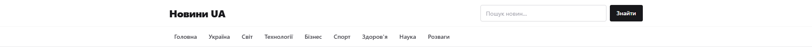
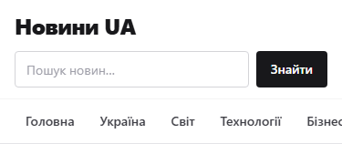

<div align="center">

# 📰 Новини UA

**SEO-орієнтований український новинний агрегатор: лише публічний RSS, без бази даних і API-ключів**

[](https://nextjs.org)
[](https://www.typescriptlang.org)
[](https://news-next-three.vercel.app)
[](./tests)
[](#)

**🟢 Демо: [news-next-three.vercel.app](https://news-next-three.vercel.app)** ·
**📜 Специфікація: [project.md](./project.md)**

</div>

---

## Можливості

- 📡 **Лише публічні RSS-джерела** — понад 30 стрічок (Україна, світ, технології, бізнес, спорт, наука, розваги); ключі, база даних і CMS не потрібні.
- 🔍 **SEO-перший підхід** — Metadata API, самоканонічні URL для кожної сторінки, Open Graph і Twitter-картки, `NewsArticle` JSON-LD, `robots.txt`, `sitemap.xml` (970+ URL).
- 📂 **Категорії та пагінація** — 25 матеріалів на сторінку, чиста URL-пагінація `/?page=2` з правильним canonical.
- 🧠 **Пошук** — зважене релевантністьне ранжування (заголовок > опис > джерело), підтримка назв джерел, буст свіжості; сторінки пошуку `noindex`.
- 🔗 **4 схожі новини** під кожною статтею, стабільні ID/слаги, дедуплікація однієї новини з різних джерел.
- 📱 **Компактна шапка** — зменшується вдвічі при скролі й лишається закріпленою над контентом (без стрибків і CLS).
- ⚡ **Серверний рендеринг** — вибірка стрічок на сервері, кеш `unstable_cache` 300 с, мінімум клієнтського JS, retry та «останній вдалий знімок» при збої RSS.
- 🇺🇦 **Український інтерфейс** — `lang="uk"`, дати у форматі `uk-UA`, семантичний HTML.
- ♿ **Якість** — Lighthouse: Accessibility **100**, Best Practices **100**, SEO **100**, Agentic **100**.

## Скріншоти

| Desktop | Mobile |
| --- | --- |
|  |  |

## Стек

| Шар | Технології |
| --- | --- |
| Фреймворк | Next.js 16.3.8 (App Router, RSC), React 19 |
| Мова та стилі | TypeScript 5, Tailwind CSS 4 |
| Дані | `rss-parser`, `fetch` + `AbortSignal.timeout`, `unstable_cache` |
| Тести | Playwright (інтеграційні, a11y, перформанс, Lighthouse, скріншоти) |
| Деплой | Vercel |

## Швидкий старт

```bash
git clone <repo-url> news-next
cd news-next
npm install
cp .env.example .env.local
npm run dev
```

Сторінка: <http://localhost:3000>

## Змінні середовища

| Змінна | Призначення |
| --- | --- |
| `NEXT_PUBLIC_SITE_URL` | Локальний origin (`http://localhost:3000`) — в `.env.local` |
| `NEXT_PUBLIC_APP_URL` | Production-домен — у налаштуваннях Vercel |

`getSiteUrl()` вибирає змінну за середовищем: локально перемагає
`NEXT_PUBLIC_SITE_URL`, на Vercel — `NEXT_PUBLIC_APP_URL` (запасний варіант —
системна `VERCEL_PROJECT_PRODUCTION_URL`). Завдяки цьому canonical, `og:url`,
`robots.txt` і `sitemap.xml` ніколи не вказують на localhost. Файл
`.env.local` у `.gitignore` і на Vercel не потрапляє.

## Команди

| Команда | Що робить |
| --- | --- |
| `npm run dev` | дев-сервер |
| `npm run build` | продакшен-збірка |
| `npm run start` | запуск зібраного застосунку |
| `npm run lint` | ESLint |
| `npm test` | Playwright (усі тести) |
| `npm run test:ui` | Playwright UI mode |
| `npm run test:report` | HTML-звіт Playwright |
| `npm run deploy` | `vercel --prod` |

## Структура

```
app/            маршрути: /, /category/[category], /news/[slug], /search,
                robots.ts, sitemap.ts, layout.tsx (метадані всього сайту)
lib/rss/        агрегація: завантаження стрічок (retry), парсинг,
                нормалізація, дедуплікація, сортування, кеш, схожі новини
lib/            пошук (lib/search.ts), SEO-хелпери (lib/seo.ts), константи
components/     шапка, картки новин, пагінація, пошук, JSON-LD
tests/          Playwright: a11y, перформанс, Lighthouse, скріншоти
project.md      повна специфікація (115 розділів) + лог інцидентів (§116)
```

## Тести і якість

```bash
npm test          # 300+ очікувань: роути, SEO-теги, a11y, TTFB, візуал
```

- візуальні baseline'и: `tests/screenshots.spec.ts-snapshots/`
- Lighthouse-аудити відбуваються окремим тестом (desktop + mobile)
- перед комітом: `npx tsc --noEmit && npm run lint && npm run build`

## Деплой

Проєкт розгорнутий на Vercel: <https://news-next-three.vercel.app>

```bash
npx vercel login   # один раз
npm run deploy     # збірка + деплой продакшену
```

Змінні середовища додаються у дашборді Vercel (Production).
Інциденти виробництва з причинами та виправленнями описані в
[project.md §116](./project.md).
